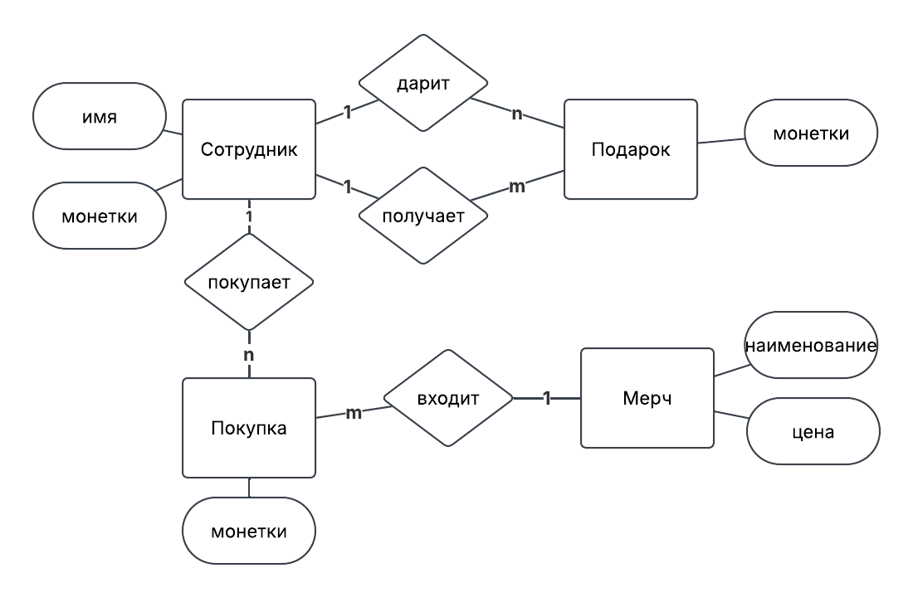
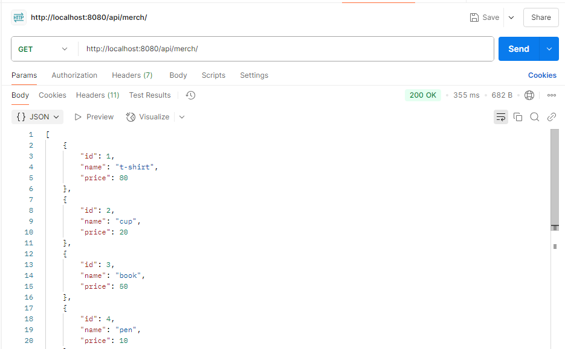
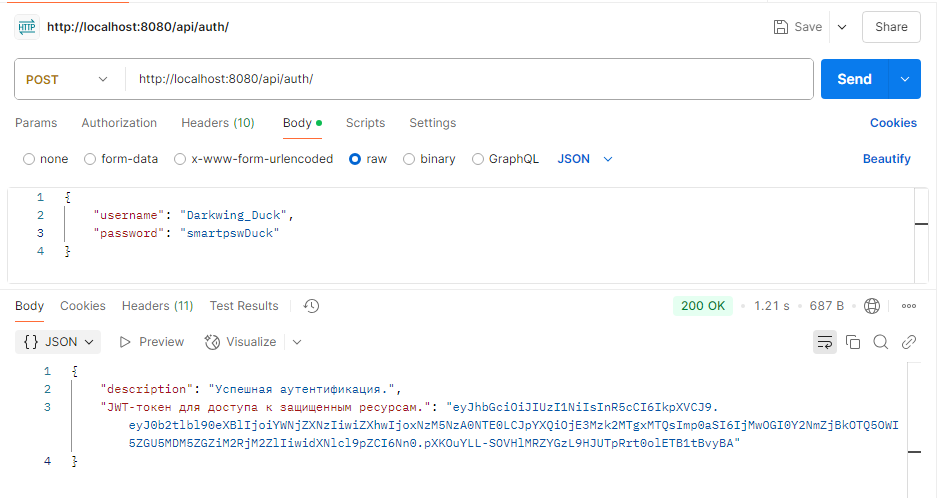
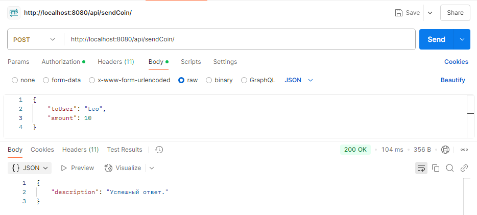
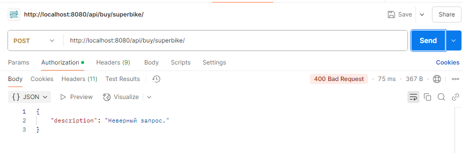
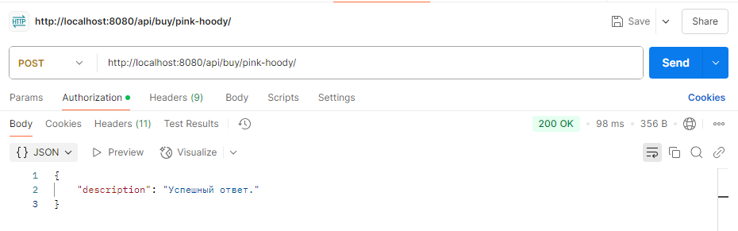
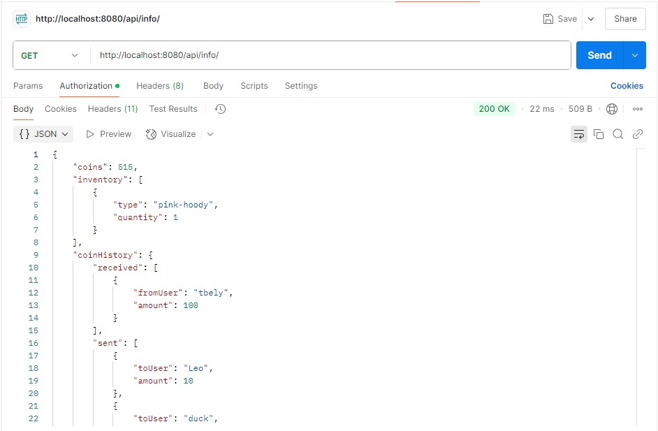

# Avito-shop
Сервис для магазина мерча, где сотрудники могут приобретать товары за монеты. Каждому новому сотруднику выделяется 1000 монет, которые можно использовать для покупки товаров. Кроме того, монеты можно передавать другим сотрудникам в знак благодарности или как подарок. Подробное ТЗ находится [здесь](https://github.com/avito-tech/tech-internship/blob/main/Tech%20Internships/Backend/Backend-trainee-assignment-winter-2025/Backend-trainee-assignment-winter-2025.md)

## Важное перед проверкой проекта
- В задании указано реализовать эндпоинт `/api/buy/{item}` через метод `get`. Но мною было принято решение использовать `post` метод. Это не влияет на логику сервиса, но больше соответствует приницпам REST, как мне кажется. 
- Для проекта используются переменные окружения. Обычно предотсавляется файл `.env_example`, где указываю, что и как заполнить, чтобы получить файл `.env`. Но поскольку проект реализован в качестве тестового задания, `.env` лежит в открытом доступе в целях быстрого запуска. 
- Для запуска проекта через Docker нужно убедиться, что в `.env` указано DEBUG=false (по умолчанию так и указано)
- Для запуска тестов нужно убедиться, что в `.env` указано DEBUG=true 

[Сразу перейти к запуску через докер](#запуск-проекта-в-контейнерах)  
[Посмотреть на примеры](#примеры-работы-сервиса)

## Содержание
- [Технологии](#технологии)
- [Функционал](#функционал)
- [Задачи](#задачи)
- [Проектирование](#проектирование)
- [Уровень моделей](#уровень-моделей)
- [Уровень сериализаторов](#уровень-сериализаторов)
- [Уровень представлений](#уровень-представлений)
- [Тестирование](#тестирование)
- [Настройка деплоя](#настройка-деплоя)
- [Запуск проекта в режиме разработки](#запуск-проекта-в-режиме-разработки)
- [Запуск проекта в контейнерах](#запуск-проекта-в-контейнерах)
- [Примеры работы сервиса](#примеры-работы-сервиса)

## Технологии
Python 3.9, Django, DRF, SQLite (на время разработки)  
Docker, Gunicorn, nginx, Postgres (для продуктивной среды)  
Библиотека pytest для тестирования  
Библиотека python-dotenv для загрузки переменных окружения   
Все требования к установке описаны в `avito_shop/requirements.txt` 

## Функционал
### Для пользователя "Сотрудник"
- авторизация
- просмотр профиля
- подарить монеты
- купить мерч
- просмотреть список мерча

### Для пользователя "Администратор"
- автоматическая загрузка данных
- панель доступа ко всем данным (при запуске в контейнерах автоматически создаётся админ и загружаются данные в мерч) 
- логирование

## Задачи
- [x] Спроектировать модель данных 
- [x] Создать проект, приложение, настроить среду
- [x] Выбрать модель для профиля (переписать User)
- [x] Продумать ручки
- [x] Создать модели
- [x] Продумать уровень валидации
- [x] Продумать уровень логики
- [x] Разделить настройки на тест и прод среды
- [x] Настроить контейнеризацию 
- [x] Тестирование
- [x] Документирование 

## Проектирование
- Модель данных ERD


- Ручки

| url       | method       | что делает      | кто может      |
|:----------|:----------|:---------:|----------:|
| `/api/info`   | `get`   | Получить информацию о монетах, инвентаре и истории транзакций.   | Авторизованный свои данные   |
| `/api/sendCoin` | `post`  | Отправить монеты другому пользователю.  | Авторизованный юзер  |
| `/api/buy/{item}`  | `get` (Странно, что get, вроде не по REST) | Купить предмет за монеты.  |Авторизованный юзер  |
| `/api/auth`  | `post` | Аутентификация и получение JWT-токена. При первой аутентификации пользователь создается автоматически.  | Любой юзер |
| `/api/merch`  | `get` | Просмотр всего списка мерча.  |Любой юзер |


## Уровень моделей
Структура данных и связи между ними представлены на уровне моделей `avito_shop/api/models.py`. Модели настроены так, чтобы в админке с ними было удобно работать (`verbose_name` и `def __str__`). Краткое описание моделей:  
- Profile: username, coins(default=1000)
- Merch: name, price
- Gift: sender, reciever, amount, datetime
- Buy: user, merch, datetime 

## Уровень сериализаторов
Валидация данных на входе и на выходе происходит на уровне сериализаторов `avito_shop/api/serializers.py`. Предусмотрены проверки наличия данных, соответствия типам, достаточного количества и других правил (например, нельзя переводить монеты себе).

## Уровень представлений
Логика обработки данных происходит на уровне представления `avito_shop/api/views.py`: создание, изменение данных, обработка ошибок, возврат ответа на запрос клиента.

# Тестирование 
Для тестирования используется библиотека pytest. В файле с переменными окружения .env должно быть указано DEBUG=true. В проекте реализовано unit-тестирование, e2e-тестирование, нагрузочное тестирование.

План:
- авторизация 
    - новый пользователь регистрируется
    - существующий пользователь получает токен
    - созданный пользователь сразу получает 1000 монет
    - с пустыми данными регистрация невозможна 
- покупка товара
    - неавторизованный не может купить товар
    - нельзя купить несуществующий товар
    - невозможно купить товар, если денег не хватает
    - успешная покупка
- передача монет
    - успешная передача монеток
    - нельзя отправить себе
    - нельзя отправить больше, чем есть
    - нельзя отправить несуществующему пользователю
    - нельзя отправить отрицательное или нулевое значение монет
- e2e тест для покупки мерча
- e2e тест для передачи монеток

Запуск тестов в общем режиме
Запуск тестов конкретные тесты


## Настройка деплоя
- Для деплоя используется Docker: `avito_shop/Dockerfile` + `docker-compose.yml`
- В `docker-compose.yml` прописаны контейнеры для БД `postgres_db`, бэкенда `avito_backend` и прокси-сервера `nginx_proxy`
- При запуске контейнера бэкенда исполняется файл `run.sh`, в котором выполняются миграции БД, сбор и копирование статики, создание админа и загрузка справочника товаров.

## Запуск проекта в режиме разработки 
Склонируйте проект
```bash
git clone git@github.com:belyashnikovatn/Avito-shop.git
```
В терминале выполните команды:
```bash
python -m venv venv
source venv/Scripts/activate
python -m pip install --upgrade pip
cd avito_shop/
pip install -r requirements.txt
python manage.py migrate
python manage.py initadmin
python manage.py loaddata merch.json
python manage.py runserver
```
Сервис станет доступным по адресу http://127.0.0.1:8000/api/  
Админка станет доступна по адресу http://127.0.0.1:8000/admin/

## Запуск проекта в контейнерах
Склонируйте проект
```bash
git clone git@github.com:belyashnikovatn/Avito-shop.git
```
Убедитесь, что Docker запущен. В корне проекта выполните команду:
```bash
docker-compose up --build  -d
```
После этого проект будет доступен по адресу http://localhost:8080/

Эндпоинты:
- http://localhost:8080/api/merch/
- http://localhost:8080/api/auth/
- http://localhost:8080/api/info/
- http://localhost:8080/api/buy/{item}/
- http://localhost:8080/api/sendCoin/


## Примеры работы сервиса

### Просмотр всех видов мерча (метод доступен всем)


### Получение токена (доступно всем)


### Перевод монеток (доступно только авторизованным)


### Покупка несуществующего мерча (доступно только авторизованным)


### Покупка существующего мерча (доступно только авторизованным)


### Просмотр профиля (доступно только авторизованным)



